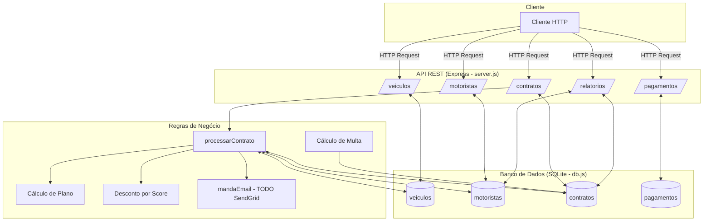
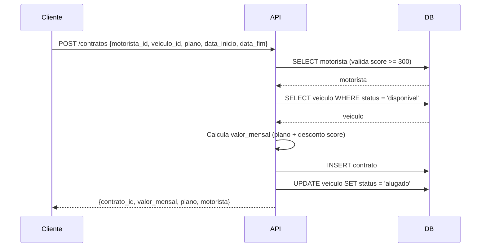
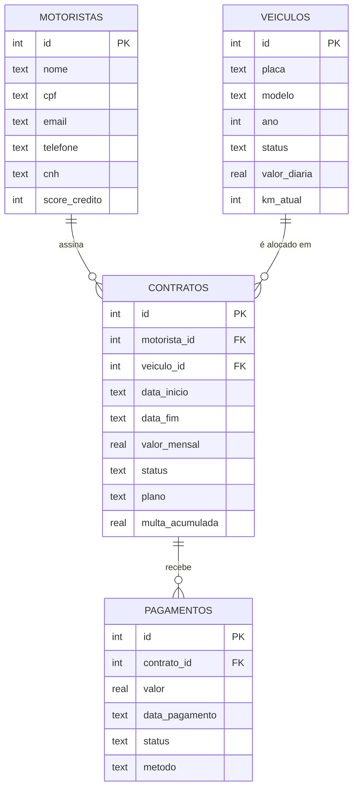

# Kovi Contratos Legado

API REST para gerenciamento de contratos de aluguel de veículos da Kovi. O sistema controla a frota de veículos, cadastro de motoristas, criação de contratos com cálculo de valores por plano e score de crédito, registro de pagamentos e geração de relatórios.

---

## Arquitetura



### Fluxo de Criação de Contrato



### Modelo de Dados



---

## Responsabilidades

| Módulo | Responsabilidade |
|--------|-----------------|
| **Veículos** | Gerenciar frota: cadastro, atualização de dados e controle de status (`disponivel`, `alugado`, `manutencao`) |
| **Motoristas** | Cadastro de motoristas com validação de score de crédito Serasa para elegibilidade de contrato |
| **Contratos** | Criação de contratos com cálculo automático de valor mensal por plano e desconto por score; controle de status e cancelamento |
| **Pagamentos** | Registro de pagamentos com múltiplos métodos (PIX, cartão, boleto) vinculados a contratos |
| **Relatórios** | Geração de relatório de inadimplentes do mês e resumo de status da frota |

### Planos disponíveis

| Plano | Multiplicador | Descrição |
|-------|--------------|-----------|
| `basico` | 1.00x | Valor base (diária × 30) |
| `plus` | 1.15x | 15% acima do básico |
| `premium` | 1.35x | 35% acima do básico |
| `flex` | ~0.807x | Cobrado por dias úteis (22/30) com 10% adicional |

### Desconto por score de crédito

| Score | Desconto |
|-------|---------|
| > 800 | 5% |
| > 600 | 3% |
| < 300 | Contrato negado |

### Cálculo de multa por atraso

| Dias em atraso | Multa |
|----------------|-------|
| > 30 dias | 10% do saldo devedor |
| 6 a 30 dias | 2,3% do saldo devedor |
| até 5 dias | Sem multa |

---

## Pré-requisitos

- [Node.js](https://nodejs.org/) >= 18
- npm >= 9

---

## Instalação

```bash
# 1. Clone o repositório
git clone <url-do-repositorio>
cd kovi-contratos-legado

# 2. Instale as dependências
npm install

# 3. Inicie o servidor
npm start
```

O servidor sobe em `http://localhost:3000`.

---

## Endpoints da API

### Veículos

| Método | Rota | Descrição |
|--------|------|-----------|
| `GET` | `/veiculos` | Lista todos os veículos |
| `GET` | `/veiculos/:id` | Busca veículo por ID |
| `POST` | `/veiculos` | Cadastra novo veículo |
| `PUT` | `/veiculos/:id` | Atualiza dados do veículo |
| `DELETE` | `/veiculos/:id` | Remove veículo |

**POST /veiculos — body:**
```json
{
  "placa": "ABC1D23",
  "modelo": "Fiat Cronos",
  "ano": 2022,
  "valor_diaria": 80.00,
  "km_atual": 15000
}
```

---

### Motoristas

| Método | Rota | Descrição |
|--------|------|-----------|
| `GET` | `/motoristas` | Lista todos os motoristas |
| `GET` | `/motoristas/:id` | Busca motorista por ID |
| `POST` | `/motoristas` | Cadastra novo motorista |
| `PUT` | `/motoristas/:id` | Atualiza nome, email e telefone |

**POST /motoristas — body:**
```json
{
  "nome": "João Silva",
  "cpf": "123.456.789-00",
  "email": "joao@email.com",
  "telefone": "11999999999",
  "cnh": "12345678900",
  "score_credito": 750
}
```

---

### Contratos

| Método | Rota | Descrição |
|--------|------|-----------|
| `GET` | `/contratos` | Lista todos os contratos |
| `GET` | `/contratos/:id` | Busca contrato por ID |
| `POST` | `/contratos` | Cria novo contrato |
| `GET` | `/contratos/:id/status` | Calcula saldo devedor e multa |
| `PUT` | `/contratos/:id/cancelar` | Cancela contrato e libera veículo |

**POST /contratos — body:**
```json
{
  "motorista_id": 1,
  "veiculo_id": 2,
  "plano": "plus",
  "data_inicio": "2024-01-01",
  "data_fim": "2024-12-31"
}
```

---

### Pagamentos

| Método | Rota | Descrição |
|--------|------|-----------|
| `POST` | `/pagamentos` | Registra pagamento |
| `GET` | `/pagamentos/contrato/:id` | Lista pagamentos de um contrato |

**POST /pagamentos — body:**
```json
{
  "contrato_id": 1,
  "valor": 2400.00,
  "data_pagamento": "2024-01-05",
  "metodo": "pix"
}
```

---

### Relatórios

| Método | Rota | Descrição |
|--------|------|-----------|
| `GET` | `/relatorios/inadimplentes` | Motoristas sem pagamento no mês atual |
| `GET` | `/relatorios/frota` | Contagem de veículos por status |

---

## Tecnologias

- **Runtime:** Node.js
- **Framework:** Express 4.17.1
- **Banco de dados:** SQLite3 5.1.7 (arquivo `kovi.db`)
